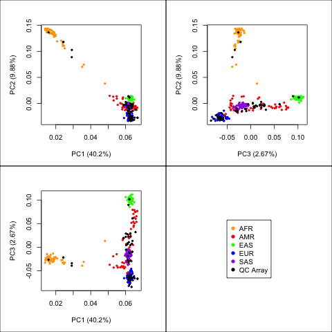
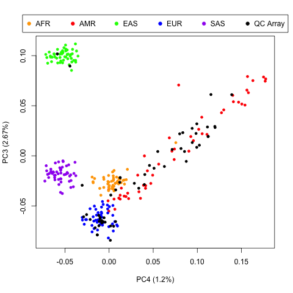

We used the Illumina Human Omni 2.5M genotyping chip from the 1000 Genomes Project data, which shares 10,422 matched probes with the QC Array, for making ancestry predictions for the following current super-populations: African (AFR), East Asian (EAS), European (EUR), South Asian (SAS), and Ad-Mixed American (AMR).

Based upon 1000 Genomes Project data from individuals of Mexican (from Los Angeles), Peruvian, Colombian, and Puerto Rican populations, we expected that the AMR assignments should be enriched for Hispanic individuals.  However, we do not consider AMR to be completely interchangeable with “Hispanic” ethnicity in independent cohorts. For example, the reference populations did not recover the different AMR populations equally well.  Nevertheless, we hope that requiring confirmation using two independent strategies should help filter ambiguous/mixed individuals. 

Please note that the code is written as if it was part of the "[Extra_Analysis](https://github.com/cwarden45/HPV_type_paper-archived_samples/tree/master/Downstream_R_Code/Extra_Analysis)" subfolder on the L1 Amplicon-Sequencing GitHub page.  For example, this would be similar to the "[Ancestry_Analysis](https://github.com/cwarden45/HPV_type_paper-archived_samples/tree/master/Downstream_R_Code/Extra_Analysis/Ancestry_Analysis)" subfolder on that page.

Lower Call Rate (<95%) Validation of Super-Populations for 1000 Genomes Samples
-----------------

The bootstrap simulation tended to assign more samples to each group compared to ADMIXTURE (configured to assign super-populations based on contributions greater than 50% or 80%). The bootstrap simulation also showed a potential advantage in recovering AMR assignments in the validation set: 

### Bootstrap Simulation
#### (>95% Confidence, 98.4% Match Overall, 89.8% Match AMR, 915 / 924 assignments)

<table>
  <tbody>
    <tr>
	<th align="center"></th>
	<th align="center">1KG-AFR</th>
  <th align="center">1KG-AMR</th>
  <th align="center">1KG-EAS</th>
  <th align="center">1KG-EUR</th>
  <th align="center">1KG-SAS</th>
    </tr>
    <tr>
	<td align="center"><b>Predicted-AFR</b></td>
	<td align="center"><b><i>181</i></b></td>
	<td align="center"><b>2</b></td>
	<td align="center">0</td>
	<td align="center">0</td>
	<td align="center">0</td>
    </tr>
    <tr>
	<td align="center"><b>Predicted-AMR</b></td>
	<td align="center">0</td>
	<td align="center"><b><i>132</i></b></td>
	<td align="center">0</td>
	<td align="center">0</td>
	<td align="center">0</td>
    </tr>
    <tr>
	<td align="center"><b>Predicted-EAS</b></td>
	<td align="center">0</td>
	<td align="center">0</td>
	<td align="center"><b><i>267</i></b></td>
	<td align="center">0</td>
	<td align="center">0</td>
    </tr>
    <tr>
	<td align="center"><b>Predicted-EUR</b></td>
	<td align="center">0</td>
	<td align="center"><b>13</b></td>
	<td align="center">0</td>
	<td align="center"><b><i>283</i></b></td>
	<td align="center">0</td>
    </tr>
    <tr>
	<td align="center"><b>Predicted-SAS</b></td>
	<td align="center">0</td>
	<td align="center">0</td>
	<td align="center">0</td>
	 <td align="center">0</td>
	<td align="center"><b><i>37</i></b></td>
    </tr>
</tbody>
</table>

### ADMIXTURE
#### (>80% Proportion, 99.4% Match Overall, 93.2% Match AMR, 813 / 924 assignments)

<table>
  <tbody>
    <tr>
	<th align="center"></th>
	<th align="center">1KG-AFR</th>
  <th align="center">1KG-AMR</th>
  <th align="center">1KG-EAS</th>
  <th align="center">1KG-EUR</th>
  <th align="center">1KG-SAS</th>
    </tr>
    <tr>
	<td align="center"><b>Predicted-AFR</b></td>
	<td align="center"><b><i>166</i></b></td>
	<td align="center">0</td>
	<td align="center">0</td>
	<td align="center">0</td>
	<td align="center">0</td>
    </tr>
    <tr>
	<td align="center"><b>Predicted-AMR</b></td>
	<td align="center">0</td>
	<td align="center"><b><i>68</i></b></td>
	<td align="center">0</td>
	<td align="center">0</td>
	<td align="center">0</td>
    </tr>
    <tr>
	<td align="center"><b>Predicted-EAS</b></td>
	<td align="center">0</td>
	<td align="center">0</td>
	<td align="center"><b><i>266</i></b></td>
	<td align="center">0</td>
	<td align="center">0</td>
    </tr>
    <tr>
	<td align="center"><b>Predicted-EUR</b></td>
	<td align="center">0</td>
	<td align="center"><b>5</b></td>
	<td align="center">0</td>
	<td align="center"><b><i>274</i></b></td>
	<td align="center">0</td>
    </tr>
    <tr>
	<td align="center"><b>Predicted-SAS</b></td>
	<td align="center">0</td>
	<td align="center">0</td>
	<td align="center">0</td>
	 <td align="center">0</td>
	<td align="center"><b><i>34</i></b></td>
    </tr>
</tbody>
</table>

### ADMIXTURE
#### (>50% Proportion, 95.6% Match Overall, 70.1% Match AMR, 902 / 924 assignments)

<table>
  <tbody>
    <tr>
	<th align="center"></th>
	<th align="center">1KG-AFR</th>
  	<th align="center">1KG-AMR</th>
 	 <th align="center">1KG-EAS</th>
 	 <th align="center">1KG-EUR</th>
 	 <th align="center">1KG-SAS</th>
    </tr>
    <tr>
	<td align="center"><b>Predicted-AFR</b></td>
	<td align="center"><b><i>181</i></b></td>
	<td align="center"><b>2</b></td>
	<td align="center">0</td>
	<td align="center">0</td>
	<td align="center">0</td>
    </tr>
    <tr>
	<td align="center"><b>Predicted-AMR</b></td>
	<td align="center">0</td>
	<td align="center"><b><i>94</i></b></td>
	<td align="center">0</td>
	<td align="center">0</td>
	<td align="center">0</td>
    </tr>
    <tr>
	<td align="center"><b>Predicted-EAS</b></td>
	<td align="center">0</td>
	<td align="center">0</td>
	<td align="center"><b><i>267</i></b></td>
	<td align="center">0</td>
	<td align="center">0</td>
    </tr>
    <tr>
	<td align="center"><b>Predicted-EUR</b></td>
	<td align="center">0</td>
	<td align="center"><b>38</b></td>
	<td align="center">0</td>
	<td align="center"><b><i>283</i></b></td>
	<td align="center">0</td>
    </tr>
    <tr>
	<td align="center"><b>Predicted-SAS</b></td>
	<td align="center">0</td>
	<td align="center">0</td>
	<td align="center">0</td>
	 <td align="center">0</td>
	<td align="center"><b><i>37</i></b></td>
    </tr>
</tbody>
</table>

1KG = 1000 Genomes ethnicity assignment. Only QC-array matched probes used for assignments.

**Also, please notice that this is different than the two ADMIXTURE proportions reported in the HPV L1 Amplicon-Sequencing paper (80% and 50%, versus 50% and 20%).**  The reason is that these are supposed to be relatively homogenous populations, while we can encounter individuals with more mixed ancestry in the patient population.

Lower Call Rate (<95%) Validation of Admixed American (AMR) Populations for 1000 Genomes Samples
-----------------

Using an additional set of 1000 Genomes samples (n=156), we tested the ability of ADMIXTURE and the bootstrap simulation to assign Colombian (CLM, n=45), Mexican from Los Angeles (MXL, n=33), Peruvian (PEL, n=43), and Puerto Rican (PUR, n=35) populations to the AMR group.  The accuracy varied between populations:

### Bootstrap Simulation
#### (>95% Confidence, 147 / 156 assignments)

<table>
  <tbody>
    <tr>
	<th align="center"></th>
	 <th align="center">1KG-CLM (85.7% Match)</th>
 	 <th align="center">1KG-MXL (97.9% Match)</th>
 	 <th align="center">1KG-PEL (100.0% Match)</th>
 	 <th align="center">1KG-PUR (72.4% Match)</th>
    </tr>
    <tr>
	<td align="center"><b>Predicted-AFR</b></td>
	<td align="center">0</td>
	<td align="center">0</td>
	<td align="center">0</td>
	<td align="center"><b>2</b></td>
    </tr>
    <tr>
	<td align="center"><b>Predicted-AMR</b></td>
	<td align="center"><b><i>36</i></b></td>
	<td align="center"><b><i>32</i></b></td>
	<td align="center"><b><i>43</i></b></td>
	<td align="center"><b><i>21</i></b></td>
    </tr>
    <tr>
	<td align="center"><b>Predicted-EAS</b></td>
	<td align="center">0</td>
	<td align="center">0</td>
	<td align="center">0</td>
	<td align="center">0</td>
    </tr>
    <tr>
	<td align="center"><b>Predicted-EUR</b></td>
	<td align="center"><b>6</b></td>
	<td align="center"><b>1</b></td>
	<td align="center">0</td>
	<td align="center"><b>6</b></td>
    </tr>
    <tr>
	<td align="center"><b>Predicted-SAS</b></td>
	<td align="center">0</td>
	<td align="center">0</td>
	<td align="center">0</td>
	<td align="center">0</td>
    </tr>
</tbody>
</table>

### ADMIXTURE
#### (>80% Proportion, 73 / 156 assignments)

<table>
  <tbody>
    <tr>
	<th align="center"></th>
	 <th align="center">1KG-CLM (50.0% Match)</th>
 	 <th align="center">1KG-MXL (95.8% Match)</th>
 	 <th align="center">1KG-PEL (100.0% Match)</th>
 	 <th align="center">1KG-PUR (0.0% Match)</th>
    </tr>
    <tr>
	<td align="center"><b>Predicted-AFR</b></td>
	<td align="center">0</td>
	<td align="center">0</td>
	<td align="center">0</td>
	<td align="center">0</td>
    </tr>
    <tr>
	<td align="center"><b>Predicted-AMR</b></td>
	<td align="center"><b><i>2</i></b></td>
	<td align="center"><b><i>23</i></b></td>
	<td align="center"><b><i>43</i></b></td>
	<td align="center"><b><i>0</i></b></td>
    </tr>
    <tr>
	<td align="center"><b>Predicted-EAS</b></td>
	<td align="center">0</td>
	<td align="center">0</td>
	<td align="center">0</td>
	<td align="center">0</td>
    </tr>
    <tr>
	<td align="center"><b>Predicted-EUR</b></td>
	<td align="center"><b>2</b></td>
	<td align="center"><b>1</b></td>
	<td align="center">0</td>
	<td align="center"><b>2</b></td>
    </tr>
    <tr>
	<td align="center"><b>Predicted-SAS</b></td>
	<td align="center">0</td>
	<td align="center">0</td>
	<td align="center">0</td>
	<td align="center">0</td>
    </tr>
</tbody>
</table>

### ADMIXTURE
#### (>50% Proportion, 134 / 156 assignments)

<table>
  <tbody>
    <tr>
	<th align="center"></th>
	 <th align="center">1KG-CLM (65.7% Match)</th>
 	 <th align="center">1KG-MXL (87.5% Match)</th>
 	 <th align="center">1KG-PEL (100.0% Match)</th>
 	 <th align="center">1KG-PUR (4.0% Match)</th>
    </tr>
    <tr>
	<td align="center"><b>Predicted-AFR</b></td>
	<td align="center">0</td>
	<td align="center">0</td>
	<td align="center">0</td>
	<td align="center"><b>2</b></td>
    </tr>
    <tr>
	<td align="center"><b>Predicted-AMR</b></td>
	<td align="center"><b><i>22</i></b></td>
	<td align="center"><b><i>28</i></b></td>
	<td align="center"><b><i>43</i></b></td>
	<td align="center"><b><i>1</i></b></td>
    </tr>
    <tr>
	<td align="center"><b>Predicted-EAS</b></td>
	<td align="center">0</td>
	<td align="center">0</td>
	<td align="center">0</td>
	<td align="center">0</td>
    </tr>
    <tr>
	<td align="center"><b>Predicted-EUR</b></td>
	<td align="center"><b>12</b></td>
	<td align="center"><b>4</b></td>
	<td align="center">0</td>
	<td align="center"><b>22</b></td>
    </tr>
    <tr>
	<td align="center"><b>Predicted-SAS</b></td>
	<td align="center">0</td>
	<td align="center">0</td>
	<td align="center">0</td>
	<td align="center">0</td>
    </tr>
</tbody>
</table>

1KG = 1000 Genomes ethnicity assignment. Match = concordance defined at super-population level.  Only QC-array matched probes used for assignments.

**Also, please notice that this is different than the two ADMIXTURE proportions reported in the HPV L1 Amplicon-Sequencing paper (80% and 50%, versus 50% and 20%).**  The reason is that these are supposed to be relatively homogenous populations, while we can encounter individuals with more mixed ancestry in the patient population.

Methods
-----------------
There is currently another studie that uses the QC Array along with 1000 Genomes Project [The 1000 Genomes Project Consortium, 2015](https://www.nature.com/articles/nature15393) data to make ancestry assignments [Ponomarenko et al. 2017](https://bmcmedgenomics.biomedcentral.com/articles/10.1186/s12920-017-0297-7), but we use a different strategy in this publication.  More specifically, we assigned samples with QC Array to super-populations if they had consistent results using ADMIXTURE (>20% ancestry assignment, [Alexander et al. 2009](https://www.ncbi.nlm.nih.gov/pubmed/19648217))  as well as using distance to median allele counts per reference set (with >95% confidence, from 1000 bootstrap simulations). ADMIXTURE was run in supervised mode with K (the parameter for number of clusters, matching the number of super-populations) = 5. 

A set of 50 unrelated 1000 Genomes samples per super-population (for a reference set of 250 samples) were used to assign clusters using the ADMIXTURE program and calculate confidence values for a distance-based strategy using a separate bootstrap simulation. Unrelated individuals were defined as those without parents in the 1000 Genomes project (thus, we excluded children from trios); individuals with siblings, second-order relatives, or third-order relatives were also removed from the reference set.

We used samples with higher call rates for probes that were also present on the QC Array (≥95%, n=766) for training, and samples with lower call rates (<95%, n=924) for validation.  We choose this strategy because call rates for the Omni 2.5M chip are higher than the call rates observed for our QC Array samples (especially given that they were archived rather than fresh).  This is shown in the tables above.

Visualizing Super-Population Clustering Using PCA Plots
-----------------

***Please note that this is not how the ancestry assignments are being made.***  However, it may be helpful in getting an overall sense of robustness of the results.

*Caption for Above Plot*: Super-population clusters of select 1000 Genomes reference samples and ICC samples with QC Array call rates >85%, plotted against the first three principal components. 1000 Genomes individuals from current African (AFR) populations   and QC Array samples from City of Hope patients that we expect have African ancestry were most clearly distinguished by the first two principal components. 1000 Genomes individuals from current European (EUR) and East Asian (EAS) populations were separated along the third and, to a lesser extent, the second principal components. 

The principal components are ordered by the amount of variance explained.  This matches divergence for those of African ancestry on the 1st and 2nd principal components.

*Caption for Above Plot*: Similar to earlier plot, with data plotted along the third and fourth principal components. Ad-Mixed American (AMR) individuals are  more distinct along the fourth principal component. Although these principal components are not the primary method for assigning ethnicities (and AMR is not completely interchangeable with Hispanic ethnicity), they provide an effective way to visualize variation among samples.  
